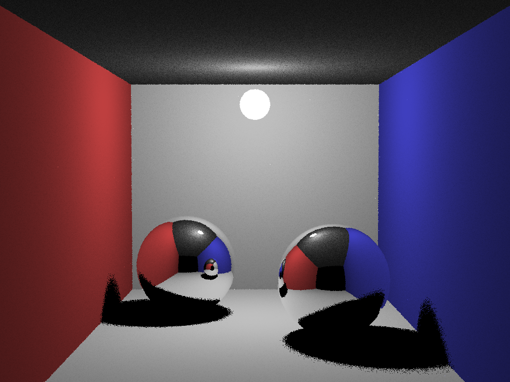

# Simple raytracer

Simple raytracer.

Object types:

- Spheres
- Lights

Material types:

- Emissive
- Mirror
- Diffuse



To run:

```
g++ -O3 -fopenmp raytracer.cpp -o raytracer
./raytracer 5
```
